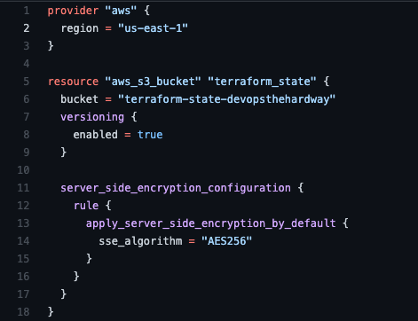

## Providers

A provider is a way to make API calls to resources. Those resources could be in AWS, Azure, or anywhere else that has a Terraform provider.

When you're working in Terraform, you must specify the provider you want to interact with. For example, if you're running code to create an S3 bucket in AWS, you must specify the AWS provider.

## Specifying A Provider

Inside of your Terraform module, you'll most likely have a `terraform.tf` file. Within that file, you specify resources that you wish to create, replace, update, or delete (CRUD)

For example, here's a resource to create an S3 bucket

```
resource "aws_s3_bucket" "terraform_state" {
  bucket = "terraform-state-bucket"
  versioning {
    enabled = true
  }
}
```

As you can see, it's creating a bucket called `terraform-state-bucket` and using a boolean to ensure versioning is on.

The code is valid, but there's one problem - it can't run without having a provider (to make API calls to AWS).

Because of that, you need to specify the provider block, like the code below.

```
provider "aws" {
  region = "us-east-1"
}

resource "aws_s3_bucket" "terraform_state" {
  bucket = "terraform-state-devopsthehardway"
  versioning {
    enabled = true
  }
}
```

The provider block is specifying the AWS provider and the region. If you're wondering why the `region` is specified, it's because some providers have required parameters. In the case of the AWS provider, the required parameter is `region`.

